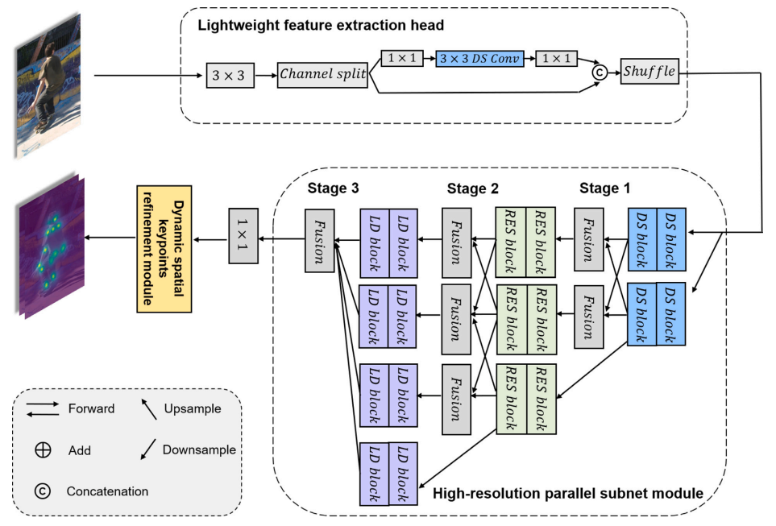
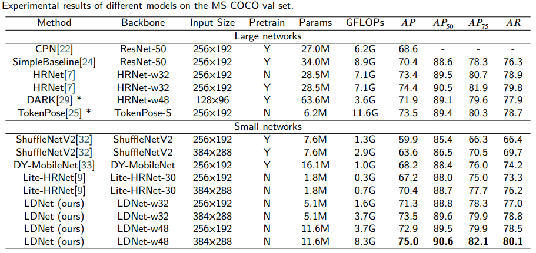
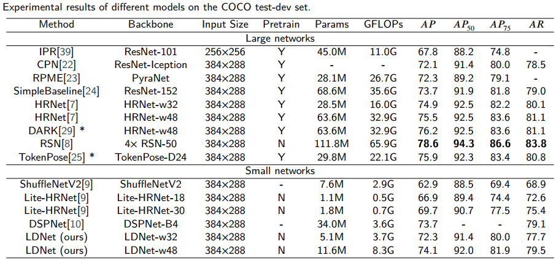
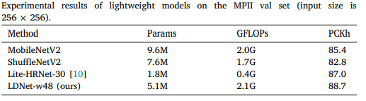
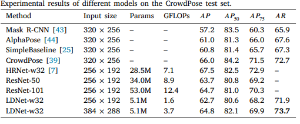

# LDNet: Lightweight dynamic convolution network for human pose estimation

## Introduction
This is an official pytorch implementation of [LDNet: Lightweight dynamic convolution network for human pose estimation ](https://www.sciencedirect.com/science/article/pii/S1474034622002439).We present a lighter model compared with existing pose estimation models, called LDNet. In order to construct it, we start from a lightweight feature extraction head to reduce the number of parameters. Then, we employ a high-resolution parallel sub-network to predict precise keypoint heatmaps. Moreover, we propose a lightweight dynamic convolution. It can cope with changing human poses by adaptively learning different convolution parameters. Finally, to further exploit the relationship between the high-level semantic and spatial structure features for accurately locating different keypoints, we propose a keypoint refinement module based on our lightweight dynamic convolution to improve the keypoint detection and location results. 


## Network Structure




## Compartive result with other models
### Results on COCO val  set


### Results on COCO test-dev set



### Results on MPII val set


### Results on CrowdPose test set




## Environment

We use  Pytorch == 1.4.0 on ubuntu18.04 and 1 NVIDIA GeForce 2080Ti to train our models.

## Dataset
### MPII
Download MPII dataset and follows the file structure:
```
LDNet_Code
         |--- data
                 |--- mpii
                         |--- annot
                         |--- images
```

### COCO
Download COCO dataset and follows the file structure:
```
LDNet_Code
         |--- data
                 |--- coco
                         |--- annotations
                         |--- person_detection_results
                         |--- images
                                   |--- train2017
                                   |--- val2017
```


## Qucik start
1、Install all packages
```
pip install -r requirements.txt
```
2、Training on MPII dataset
```
python tools/train_mpii.py
```
3、Testing on MPII dataset
```
python tools/test_mpii.py
```
4、Training on COCO dataset
```
python tools/train.py
```
5、Testing on COCO dataset
```
python tools/test.py
```

### Citation
If you use our code or models in your research, please cite with:
```
@article{xu2022ldnet,
  title={LDNet: Lightweight dynamic convolution network for human pose estimation},
  author={Xu, Dingning and Zhang, Rong and Guo, Lijun and Feng, Cun and Gao, Shangce},
  journal={Advanced Engineering Informatics},
  volume={54},
  pages={101785},
  year={2022},
  publisher={Elsevier}
}
```
